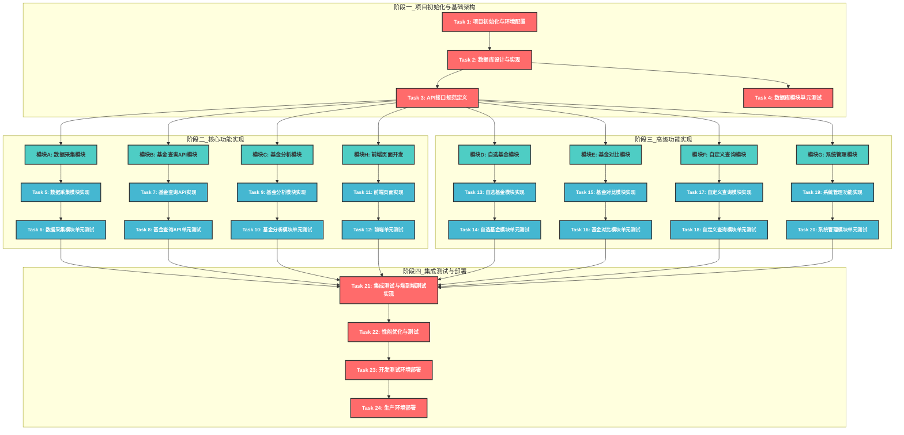

# 基金信息管理分析系统 - 实施计划

## 执行流程图

## 阶段执行顺序说明
- **阶段之间**：串行执行（每个阶段必须在前一阶段完成后开始）
- **阶段内部**：并行执行（同一阶段内的多个模块可以同时进行）
- **模块内部**：串行执行（每个模块的实现和对应的单元测试必须按顺序完成）
- **前后端并行**：一旦API接口规范确定，前端和后端开发可以并行进行

## 阶段一：项目初始化与基础架构

### [x] Task 1: 项目初始化与环境配置
- **Priority**: P0
- **Depends On**: None
- **Description**:
  - 创建项目目录结构
  - 配置开发环境（.NET 8, Node.js, Python）
  - 初始化后端项目（.NET Web API）
  - 初始化前端项目（Vue 3）
  - 配置项目依赖项
- **Acceptance Criteria Addressed**: AC-1, AC-2, AC-3, AC-4, AC-5, AC-6, AC-7, AC-8
- **Test Requirements**:
  - `programmatic` TR-1.1: 项目结构搭建完成，环境配置正确
  - `programmatic` TR-1.2: 后端服务能够启动并响应API请求
  - `programmatic` TR-1.3: 前端项目能够启动并显示基础页面
- **Notes**: 确保所有依赖项正确安装，环境配置完整

### [x] Task 2: 数据库设计与实现
- **Priority**: P0
- **Depends On**: Task 1
- **Description**:
  - 创建完整的数据库表结构，包括：
    - fund_basic_info (基金基本信息表)
    - fund_nav_history (基金历史净值表)
    - fund_performance (基金业绩表)
    - fund_asset_scale (基金资产规模表)
    - fund_manager (基金经理表)
    - fund_purchase_status (基金申购状态表)
    - fund_redemption_status (基金赎回状态表)
    - fund_corporate_actions (基金公司行为表)
    - user_favorite_funds (用户自选基金表)
    - user_favorite_scores (自选基金多因子评分表)
  - 实现所有表的字段定义，确保与需求文档一致
  - 实现数据库索引设计
  - 配置Entity Framework Core
  - 实现数据迁移
  - 配置数据库连接字符串
- **Acceptance Criteria Addressed**: AC-1, AC-2, AC-3, AC-4, AC-5, AC-7, FR-9
- **Test Requirements**:
  - `programmatic` TR-2.1: 所有10个数据库表结构创建完成
  - `programmatic` TR-2.2: 所有表的字段定义与需求文档一致
  - `programmatic` TR-2.3: 数据迁移执行成功
  - `programmatic` TR-2.4: 数据库连接正常
  - `programmatic` TR-2.5: 所有索引创建完成
- **Notes**: 确保表结构设计符合需求文档和详细设计文档，索引配置合理，字段类型和长度正确

### [x] Task 3: API接口规范定义
- **Priority**: P0
- **Depends On**: Task 2
- **Description**:
  - 定义基金查询API接口规范：
    - GET /funds - 获取基金列表
    - GET /funds/{code} - 获取单个基金详情
    - GET /funds/{code}/nav - 获取基金历史净值
    - GET /funds/{code}/performance - 获取基金业绩指标
    - GET /funds/{code}/managers - 获取基金经理信息
    - GET /funds/{code}/scale - 获取基金规模历史
  - 定义分析API接口规范：
    - GET /analysis/ranking - 单周期基金排名
    - GET /analysis/change - 周期变化率排名
    - GET /analysis/consistency - 多周期一致性筛选
    - GET /analysis/multifactor - 多因子量化评估
    - POST /analysis/compare - 基金对比分析
  - 定义自选基金API接口规范：
    - GET /favorites - 获取用户自选基金列表
    - POST /favorites - 添加基金到自选
    - DELETE /favorites/{code} - 从自选移除基金
    - PUT /favorites/sort - 更新自选基金排序
    - PUT /favorites/{code}/note - 更新自选基金备注
    - GET /favorites/groups - 获取用户自选分组
    - POST /favorites/groups - 创建新分组
    - PUT /favorites/{code}/group - 移动基金到指定分组
  - 定义自选基金评分API接口规范：
    - GET /favorites/scores - 获取自选基金多因子评分
    - POST /favorites/scores/calculate - 手动触发评分计算
    - GET /favorites/scores/history - 获取评分历史趋势
    - GET /favorites/scores/weights - 获取用户权重配置
    - PUT /favorites/scores/weights - 更新用户权重配置
  - 定义自定义查询API接口规范：
    - POST /query/kql - 执行自定义KQL查询
    - GET /query/history - 获取查询历史记录
    - POST /query/templates - 保存查询模板
    - GET /query/templates - 获取查询模板列表
  - 定义系统API接口规范：
    - GET /meta/fund-types - 获取所有基金类型
    - GET /meta/managers - 获取所有基金管理人
    - GET /system/status - 获取系统运行状态
    - POST /system/update - 手动触发数据更新
    - GET /system/update-history - 获取数据更新历史
  - 定义统一的请求/响应格式和错误处理机制
  - 生成API接口文档
- **Acceptance Criteria Addressed**: AC-2, AC-3, AC-4, AC-5, AC-6, AC-7, AC-8
- **Test Requirements**:
  - `programmatic` TR-3.1: API接口规范文档完整
  - `human-judgment` TR-3.2: API接口设计合理，符合RESTful规范
  - `programmatic` TR-3.3: 所有API接口路径和参数定义清晰
  - `programmatic` TR-3.4: 响应格式统一，错误处理机制完善
- **Notes**: 生成API接口文档，包括请求/响应格式、参数说明、错误码定义等，确保与详细设计文档一致

### [x] Task 4: 数据库模块单元测试
- **Priority**: P0
- **Depends On**: Task 2
- **Description**:
  - 为数据库模块编写单元测试
  - 测试数据库连接和迁移
  - 测试数据访问操作
  - 测试数据库索引性能
  - 确保编译通过，没有错误和警告
  - 检查代码覆盖率，确保达到70%以上
- **Acceptance Criteria Addressed**: NFR-4
- **Test Requirements**:
  - `programmatic` TR-4.1: 所有单元测试通过
  - `programmatic` TR-4.2: 代码覆盖率 >= 70%
  - `programmatic` TR-4.3: 编译通过，没有错误和警告
- **Notes**: 使用xUnit编写单元测试，使用内存数据库进行测试

## 阶段二：核心功能实现（并行执行）

### 模块A：数据采集模块

#### [x] Task 5: 数据采集模块实现
- **Priority**: P0
- **Depends On**: Task 2
- **Description**:
  - 实现Python数据采集脚本，集成akshare API
  - 实现基金基本信息采集功能
  - 实现基金历史净值采集功能
  - 实现基金业绩数据采集功能
  - 实现基金资产规模采集功能
  - 实现基金经理信息采集功能
  - 实现基金公司行为事件采集功能
  - 实现数据清洗和校验机制
  - 实现数据存储到SQLite数据库
  - 实现.NET BackgroundService定时任务调度
  - 实现数据更新并发控制（文件锁机制）
  - 实现错误处理和重试机制（指数退避策略）
  - 实现akshare API限流处理（随机延时）
  - 实现复权净值计算功能
  - 实现数据质量检查功能
- **Acceptance Criteria Addressed**: AC-1, FR-1
- **Test Requirements**:
  - `programmatic` TR-5.1: 数据采集脚本能够成功从akshare获取数据
  - `programmatic` TR-5.2: 数据能够正确存储到数据库
  - `programmatic` TR-5.3: 定时任务能够正常执行
  - `programmatic` TR-5.4: 能够处理akshare API限流问题
  - `programmatic` TR-5.5: 数据更新并发控制正常
  - `programmatic` TR-5.6: 复权净值计算准确
  - `programmatic` TR-5.7: 数据质量检查功能正常
- **Notes**: 处理akshare API限流问题，实现重试机制，确保所有数据库表的数据更新

#### [x] Task 6: 数据采集模块单元测试
- **Priority**: P0
- **Depends On**: Task 5
- **Description**:
  - 为数据采集模块编写单元测试
  - 测试数据采集功能
  - 测试数据清洗和校验
  - 测试定时任务调度
  - 测试错误处理和重试机制
  - 确保编译通过，没有错误和警告
  - 检查代码覆盖率，确保达到70%以上
- **Acceptance Criteria Addressed**: NFR-4
- **Test Requirements**:
  - `programmatic` TR-6.1: 所有单元测试通过
  - `programmatic` TR-6.2: 代码覆盖率 >= 70%
  - `programmatic` TR-6.3: 编译通过，没有错误和警告
- **Notes**: 使用pytest（Python）和xUnit（.NET）编写单元测试

### 模块B：基金查询API模块

#### [ ] Task 7: 基金查询API实现
- **Priority**: P0
- **Depends On**: Task 3
- **Description**:
  - 实现基金列表查询API
  - 实现基金详情查询API
  - 实现基金净值历史查询API
  - 实现基金业绩查询API
  - 实现基金经理查询API
  - 实现基金规模查询API
  - 实现缓存机制，优化查询性能
  - 实现API限流
- **Acceptance Criteria Addressed**: AC-2, AC-3
- **Test Requirements**:
  - `programmatic` TR-7.1: API能够返回正确的基金数据
  - `programmatic` TR-7.2: API响应时间符合性能要求
  - `programmatic` TR-7.3: API支持筛选和分页
  - `programmatic` TR-7.4: 缓存机制正常工作
- **Notes**: 实现缓存机制，优化查询性能

#### [ ] Task 8: 基金查询API单元测试
- **Priority**: P0
- **Depends On**: Task 7
- **Description**:
  - 为基金查询API编写单元测试
  - 测试基金列表查询
  - 测试基金详情查询
  - 测试基金净值历史查询
  - 测试基金业绩查询
  - 测试基金经理查询
  - 测试基金规模查询
  - 测试缓存机制
  - 确保编译通过，没有错误和警告
  - 检查代码覆盖率，确保达到70%以上
- **Acceptance Criteria Addressed**: NFR-4
- **Test Requirements**:
  - `programmatic` TR-8.1: 所有单元测试通过
  - `programmatic` TR-8.2: 代码覆盖率 >= 70%
  - `programmatic` TR-8.3: 编译通过，没有错误和警告
- **Notes**: 使用xUnit编写单元测试，使用模拟数据进行测试

### 模块C：基金分析模块

#### [ ] Task 9: 基金分析模块实现
- **Priority**: P0
- **Depends On**: Task 3
- **Description**:
  - 实现单周期排名筛选功能（支持周/月/季/年维度）
  - 实现周期变化率排名筛选功能（支持绝对变化值和相对变化率）
  - 实现多周期一致性筛选功能（支持自定义时间范围和间隔）
  - 实现多因子量化评估功能（支持自定义因子权重）
  - 实现复权净值计算功能（支持向前复权）
  - 实现基金对比分析功能
  - 实现结果缓存机制（内存缓存 + 本地缓存）
  - 优化计算性能（异步计算，并行处理）
  - 实现多因子评分模型（收益因子、风险因子、风险调整收益、排名因子）
  - 实现评分权重配置管理
- **Acceptance Criteria Addressed**: AC-4, FR-4, FR-6
- **Test Requirements**:
  - `programmatic` TR-9.1: 分析计算结果准确
  - `programmatic` TR-9.2: 分析计算性能符合要求
  - `programmatic` TR-9.3: 多因子评分计算正确
  - `programmatic` TR-9.4: 复权净值计算准确
  - `programmatic` TR-9.5: 基金对比分析功能正常
  - `programmatic` TR-9.6: 缓存机制正常工作
- **Notes**: 优化计算性能，实现结果缓存，确保多因子评分模型的准确性

#### [ ] Task 10: 基金分析模块单元测试
- **Priority**: P0
- **Depends On**: Task 9
- **Description**:
  - 为基金分析模块编写单元测试
  - 测试单周期排名筛选
  - 测试周期变化率排名筛选
  - 测试多周期一致性筛选
  - 测试多因子量化评估
  - 测试复权净值计算
  - 测试结果缓存
  - 确保编译通过，没有错误和警告
  - 检查代码覆盖率，确保达到70%以上
- **Acceptance Criteria Addressed**: NFR-4
- **Test Requirements**:
  - `programmatic` TR-10.1: 所有单元测试通过
  - `programmatic` TR-10.2: 代码覆盖率 >= 70%
  - `programmatic` TR-10.3: 编译通过，没有错误和警告
- **Notes**: 使用xUnit编写单元测试，使用模拟数据进行测试

### 模块H：前端页面开发（与后端API并行）

#### [/] Task 11: 前端页面实现
- **Priority**: P0
- **Depends On**: Task 3
- **Description**:
  - 实现首页/仪表盘（系统概览、市场概览、自选基金快览）
  - 实现基金列表页（支持筛选、排序、分页）
  - 实现基金详情页（基本信息、净值走势、业绩指标、基金经理信息）
  - 实现分析页面：
    - 单周期排名页（支持Top/Bottom排名）
    - 周期变化率排名页（支持绝对变化值和相对变化率）
    - 多因子评估页（支持自定义权重、雷达图展示）
  - 实现基金对比页（基本信息对比、业绩指标对比、净值走势对比、雷达图对比）
  - 实现自选基金页（添加/移除、分组管理、排序管理、备注和提醒设置、多因子评分）
  - 实现自定义查询页（KQL查询编辑器、结果展示、查询历史、查询模板）
  - 实现系统设置页（数据管理、系统状态、备份恢复）
  - 使用Mock API进行前端开发和测试
  - 实现响应式设计（桌面端、平板端、移动端）
  - 实现数据可视化（ECharts图表）
  - 实现状态管理（Pinia）
  - 实现本地存储策略（localStorage、sessionStorage、IndexedDB）
  - 实现路由管理（Vue Router）
  - 实现组件通信机制
- **Acceptance Criteria Addressed**: AC-2, AC-3, AC-4, AC-5, AC-6, AC-7, AC-8
- **Test Requirements**:
  - `human-judgment` TR-11.1: 页面布局合理，响应式设计
  - `human-judgment` TR-11.2: 交互流畅，用户体验良好
  - `human-judgment` TR-11.3: 数据可视化效果清晰
  - `programmatic` TR-11.4: 前端页面能够正确调用API
  - `programmatic` TR-11.5: 状态管理正常工作
  - `programmatic` TR-11.6: 路由导航正常
  - `programmatic` TR-11.7: 本地存储策略正常
- **Notes**: 优化前端性能，实现懒加载和缓存，确保响应式设计适配不同设备

#### [ ] Task 12: 前端单元测试
- **Priority**: P0
- **Depends On**: Task 11
- **Description**:
  - 为前端组件编写单元测试
  - 测试核心组件功能
  - 测试状态管理
  - 测试路由导航
  - 测试API调用
  - 确保编译通过，没有错误和警告
  - 检查代码覆盖率，确保达到70%以上
- **Acceptance Criteria Addressed**: NFR-4
- **Test Requirements**:
  - `programmatic` TR-12.1: 所有单元测试通过
  - `programmatic` TR-12.2: 代码覆盖率 >= 70%
  - `programmatic` TR-12.3: 编译通过，没有错误和警告
- **Notes**: 使用Jest或Vitest编写前端单元测试

## 阶段三：高级功能实现（并行执行）

### 模块D：自选基金模块

#### [x] Task 13: 自选基金模块实现
- **Priority**: P1
- **Depends On**: Task 3
- **Description**:
  - 实现自选基金添加/移除功能
  - 实现分组管理功能
  - 实现排序管理功能
  - 实现备注和提醒设置
  - 实现自选基金多因子评分
  - 实现评分历史记录
  - 实现权重配置管理
- **Acceptance Criteria Addressed**: AC-5
- **Test Requirements**:
  - `programmatic` TR-13.1: 自选基金操作功能正常
  - `programmatic` TR-13.2: 多因子评分计算正确
  - `programmatic` TR-13.3: 分组和排序功能正常
  - `programmatic` TR-13.4: 评分历史记录正常
- **Notes**: 实现前端状态管理，确保数据一致性

#### [x] Task 14: 自选基金模块单元测试
- **Priority**: P1
- **Depends On**: Task 13
- **Description**:
  - 为自选基金模块编写单元测试
  - 测试自选基金添加/移除功能
  - 测试分组管理功能
  - 测试排序管理功能
  - 测试备注和提醒设置
  - 测试自选基金多因子评分
  - 测试评分历史记录
  - 测试权重配置管理
  - 确保编译通过，没有错误和警告
  - 检查代码覆盖率，确保达到70%以上
- **Acceptance Criteria Addressed**: NFR-4
- **Test Requirements**:
  - `programmatic` TR-14.1: 所有单元测试通过
  - `programmatic` TR-14.2: 代码覆盖率 >= 70%
  - `programmatic` TR-14.3: 编译通过，没有错误和警告
- **Notes**: 使用xUnit编写单元测试

### 模块E：基金对比模块

#### [x] Task 15: 基金对比模块实现
- **Priority**: P1
- **Depends On**: Task 3
- **Description**:
  - 实现基金对比功能
  - 实现基本信息对比
  - 实现业绩指标对比
  - 实现净值走势对比图
  - 实现多因子雷达图对比
  - 实现对比结果导出
- **Acceptance Criteria Addressed**: AC-6
- **Test Requirements**:
  - `programmatic` TR-15.1: 对比功能能够正常执行
  - `human-judgment` TR-15.2: 对比结果显示清晰直观
  - `human-judgment` TR-15.3: 图表显示正确
  - `programmatic` TR-15.4: 对比结果导出功能正常
- **Notes**: 优化前端渲染性能，确保多只基金对比时的响应速度

#### [x] Task 16: 基金对比模块单元测试
- **Priority**: P1
- **Depends On**: Task 15
- **Description**:
  - 为基金对比模块编写单元测试
  - 测试基金对比功能
  - 测试基本信息对比
  - 测试业绩指标对比
  - 测试对比结果导出
  - 确保编译通过，没有错误和警告
  - 检查代码覆盖率，确保达到70%以上
- **Acceptance Criteria Addressed**: NFR-4
- **Test Requirements**:
  - `programmatic` TR-16.1: 所有单元测试通过
  - `programmatic` TR-16.2: 代码覆盖率 >= 70%
  - `programmatic` TR-16.3: 编译通过，没有错误和警告
- **Notes**: 使用xUnit编写单元测试

### 模块F：自定义查询模块

#### [x] Task 17: 自定义查询模块实现
- **Priority**: P1
- **Depends On**: Task 3
- **Description**:
  - 实现KQL查询解析器（支持where、project、limit操作符）
  - 实现查询执行器（参数化查询，防止SQL注入）
  - 实现结果格式化器（支持JSON、CSV、Excel格式）
  - 实现查询结果可视化（表格展示、图表展示）
  - 实现查询安全限制：
    - 最大返回条数限制（1000条）
    - 最大查询时间限制（5秒）
    - 禁止的数据修改操作
    - 允许的表白名单
  - 实现查询历史记录（存储用户查询历史）
  - 实现查询模板管理（保存和加载查询模板）
  - 实现查询语法高亮和错误提示
- **Acceptance Criteria Addressed**: AC-7, FR-7
- **Test Requirements**:
  - `programmatic` TR-17.1: KQL查询能够正确解析和执行
  - `programmatic` TR-17.2: 查询结果准确
  - `human-judgment` TR-17.3: 查询结果显示清晰
  - `programmatic` TR-17.4: 查询安全限制有效
  - `programmatic` TR-17.5: 查询历史记录功能正常
  - `programmatic` TR-17.6: 查询模板管理功能正常
- **Notes**: 实现查询安全限制，防止SQL注入，确保查询性能和安全性

#### [x] Task 18: 自定义查询模块单元测试
- **Priority**: P1
- **Depends On**: Task 17
- **Description**:
  - 为自定义查询模块编写单元测试
  - 测试KQL查询解析器
  - 测试查询执行器
  - 测试结果格式化器
  - 测试查询安全限制
  - 测试查询历史记录
  - 测试查询模板管理
  - 确保编译通过，没有错误和警告
  - 检查代码覆盖率，确保达到70%以上
- **Acceptance Criteria Addressed**: NFR-4
- **Test Requirements**:
  - `programmatic` TR-18.1: 所有单元测试通过
  - `programmatic` TR-18.2: 代码覆盖率 >= 70%
  - `programmatic` TR-18.3: 编译通过，没有错误和警告
- **Notes**: 使用xUnit编写单元测试

### 模块G：系统管理模块

#### [x] Task 19: 系统管理功能实现
- **Priority**: P1
- **Depends On**: Task 3, Task 5
- **Description**:
  - 实现数据备份与恢复功能：
    - 每日自动备份SQLite数据库文件
    - 保留最近7天的每日备份和每月1号的月备份
    - 支持手动备份和恢复
    - 恢复前自动创建当前数据快照
  - 实现系统状态监控：
    - 系统运行状态监控
    - 数据更新状态监控
    - 性能指标监控
    - 异常告警机制
  - 实现数据更新历史查询：
    - 记录每次数据更新的状态、耗时、数据量
    - 提供更新历史查询接口
  - 实现日志管理：
    - 结构化JSON格式日志
    - 支持多级别日志（DEBUG/INFO/WARNING/ERROR）
    - 日志分类（DataUpdate/API/Query/System/Security）
    - 日志归档和清理
  - 实现系统配置管理：
    - 配置文件外置
    - 支持环境变量配置
    - 配置热重载
  - 实现用户权限管理（V1版本简化版）：
    - 单用户模式，无需登录
    - 基本的访问控制
- **Acceptance Criteria Addressed**: AC-8, FR-8
- **Test Requirements**:
  - `programmatic` TR-19.1: 数据备份和恢复功能正常
  - `programmatic` TR-19.2: 系统状态监控功能正常
  - `programmatic` TR-19.3: 日志记录完整
  - `programmatic` TR-19.4: 系统配置管理功能正常
  - `programmatic` TR-19.5: 数据更新历史查询功能正常
  - `programmatic` TR-19.6: 异常告警机制正常
- **Notes**: 确保备份数据的安全性和可靠性，实现完善的监控和日志系统

#### [x] Task 20: 系统管理模块单元测试
- **Priority**: P1
- **Depends On**: Task 19
- **Description**:
  - 为系统管理模块编写单元测试
  - 测试数据备份与恢复功能
  - 测试系统状态监控
  - 测试数据更新历史查询
  - 测试日志管理
  - 测试系统配置管理
  - 确保编译通过，没有错误和警告
  - 检查代码覆盖率，确保达到70%以上
- **Acceptance Criteria Addressed**: NFR-4
- **Test Requirements**:
  - `programmatic` TR-20.1: 所有单元测试通过
  - `programmatic` TR-20.2: 代码覆盖率 >= 70%
  - `programmatic` TR-20.3: 编译通过，没有错误和警告
- **Notes**: 使用xUnit编写单元测试

## 阶段四：集成测试与部署

### [x] Task 21: 集成测试与端到端测试实现
- **Priority**: P0
- **Depends On**: Task 4, Task 6, Task 8, Task 10, Task 12, Task 14, Task 16, Task 18, Task 20
- **Description**:
  - 编写集成测试代码（测试API接口、数据库访问、数据采集等）
  - 编写端到端测试代码（测试完整业务流程）
  - 执行集成测试
  - 执行端到端测试
  - 确保测试代码编译通过，没有错误和警告
  - 生成测试报告
- **Acceptance Criteria Addressed**: AC-1, AC-2, AC-3, AC-4, AC-5, AC-6, AC-7, AC-8
- **Test Requirements**:
  - `programmatic` TR-21.1: 集成测试通过
  - `programmatic` TR-21.2: 端到端测试通过
  - `programmatic` TR-21.3: 测试代码编译通过，没有错误和警告
- **Notes**: 使用xUnit（.NET）和Playwright/Selenium（端到端测试）编写测试代码

### [ ] Task 22: 性能优化与测试
- **Priority**: P1
- **Depends On**: Task 5, Task 7, Task 9, Task 11, Task 21
- **Description**:
  - 优化数据库查询性能
  - 优化API响应时间
  - 优化前端渲染性能
  - 执行性能测试
  - 执行功能测试
  - 执行安全测试
  - 生成性能测试报告
- **Acceptance Criteria Addressed**: NFR-1, NFR-2
- **Test Requirements**:
  - `programmatic` TR-22.1: 基金列表加载时间 < 2秒
  - `programmatic` TR-22.2: 单次分析计算时间 < 10秒
  - `programmatic` TR-22.3: 数据更新时间（增量） < 15分钟
  - `programmatic` TR-22.4: 系统安全性测试通过
- **Notes**: 使用性能分析工具，找出瓶颈并优化

### [x] Task 23: 开发测试环境部署
- **Priority**: P0
- **Depends On**: Task 1, Task 21, Task 22
- **Description**:
  - 配置开发测试环境
  - 实现容器化部署（Docker）
  - 配置Nginx反向代理
  - 执行集成测试
  - 执行端到端测试
  - 配置监控和日志系统
- **Acceptance Criteria Addressed**: AC-1, AC-2, AC-3, AC-4, AC-5, AC-6, AC-7, AC-8
- **Test Requirements**:
  - `programmatic` TR-23.1: 容器化部署成功
  - `programmatic` TR-23.2: 系统在开发测试环境正常运行
  - `programmatic` TR-23.3: 集成测试通过
  - `programmatic` TR-23.4: 端到端测试通过
  - `programmatic` TR-23.5: 监控和日志系统正常工作
- **Notes**: 确保开发测试环境部署顺利，系统能够稳定运行

### [ ] Task 24: 生产环境部署
- **Priority**: P0
- **Depends On**: Task 23
- **Description**:
  - 配置生产环境
  - 实现容器化部署（Docker）
  - 配置Nginx反向代理
  - 执行生产环境验证测试
  - 部署到生产环境
  - 配置生产环境监控和告警
  - 制定应急预案
- **Acceptance Criteria Addressed**: AC-1, AC-2, AC-3, AC-4, AC-5, AC-6, AC-7, AC-8
- **Test Requirements**:
  - `programmatic` TR-24.1: 容器化部署成功
  - `programmatic` TR-24.2: 系统在生产环境正常运行
  - `human-judgment` TR-24.3: 系统整体性能满足要求
  - `programmatic` TR-24.4: 监控和告警系统正常工作
- **Notes**: 确保生产环境部署顺利，系统能够稳定运行