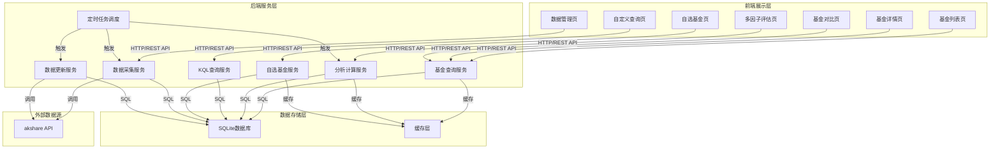
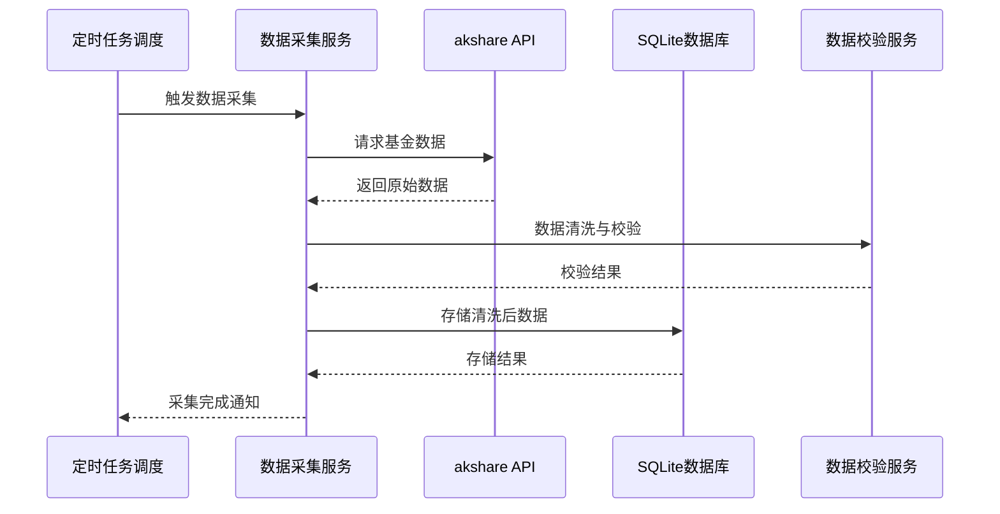
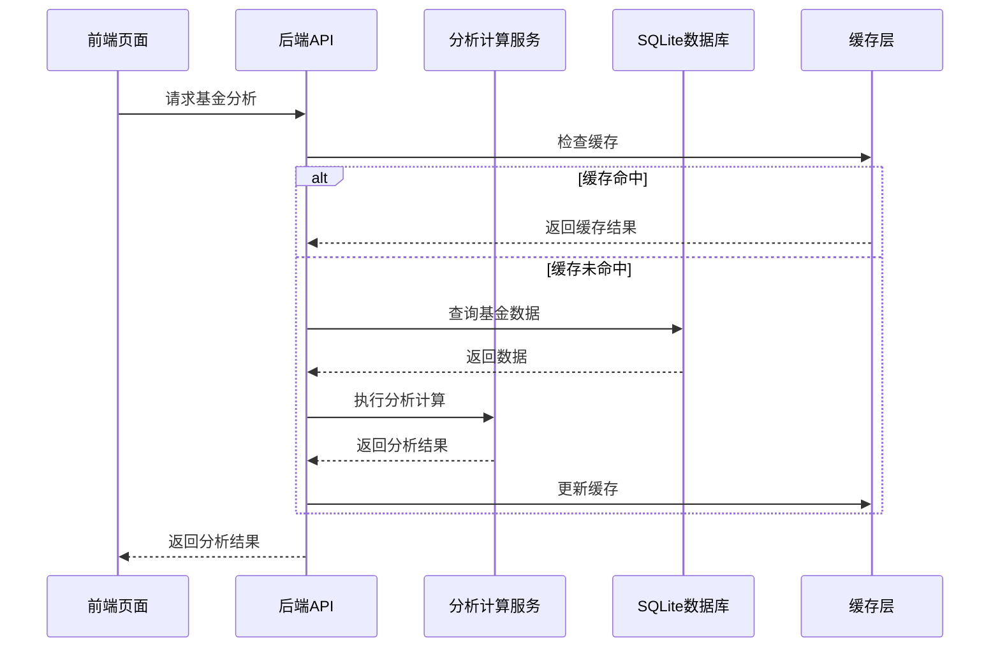

# 基金信息管理分析系统详细设计文档

## 1. 系统架构设计

### 1.1 整体架构

系统采用前后端分离架构，由前端展示层、后端服务层、数据存储层和外部数据源组成。



### 1.2 技术栈选择

| 层级 | 技术 | 版本 | 用途 |
|------|------|------|------|
| 前端 | Vue | 3.x | 前端框架 |
| 前端 | Element Plus | 2.x | UI组件库 |
| 前端 | ECharts | 5.x | 数据可视化 |
| 后端 | .NET | 8.0 | Web API服务 |
| 后端 | Entity Framework Core | 8.0 | ORM框架 |
| 后端 | Quartz.NET | 3.6+ | 定时任务调度 |
| 数据库 | SQLite | 3.x | 数据存储 |
| 数据采集 | Python | 3.11+ | 脚本语言 |
| 数据采集 | akshare | 1.12+ | 基金数据API |

### 1.3 核心流程图

#### 1.3.1 数据采集流程



#### 1.3.2 基金分析流程



## 2. 数据库设计

### 2.1 表结构设计

#### 2.1.1 基金基本信息表 (fund_basic_info)

| 字段名 | 数据类型 | 约束 | 描述 |
|--------|----------|------|------|
| code | VARCHAR(20) | PRIMARY KEY | 基金代码 |
| name | VARCHAR(100) | NOT NULL | 基金名称 |
| fund_type | VARCHAR(20) | NOT NULL | 基金类型 |
| share_type | VARCHAR(10) | NOT NULL | 份额类型 |
| main_fund_code | VARCHAR(20) | NULL | 主基金代码 |
| establish_date | DATE | NOT NULL | 成立日期 |
| list_date | DATE | NULL | 上市日期 |
| manager | VARCHAR(100) | NOT NULL | 基金管理人 |
| custodian | VARCHAR(100) | NOT NULL | 基金托管人 |
| management_fee_rate | DECIMAL(5,4) | NOT NULL | 管理费率 |
| custodian_fee_rate | DECIMAL(5,4) | NOT NULL | 托管费率 |
| sales_fee_rate | DECIMAL(5,4) | NULL | 销售服务费率 |
| benchmark | VARCHAR(500) | NULL | 业绩比较基准 |
| tracking_target | VARCHAR(100) | NULL | 跟踪标的 |
| investment_style | VARCHAR(20) | NULL | 投资风格 |
| risk_level | VARCHAR(10) | NULL | 风险等级 |
| update_time | DATETIME | NOT NULL | 更新时间 |

#### 2.1.2 基金资产规模表 (fund_asset_scale)

| 字段名 | 数据类型 | 约束 | 描述 |
|--------|----------|------|------|
| code | VARCHAR(20) | NOT NULL | 基金代码 |
| date | DATE | NOT NULL | 规模统计日期 |
| asset_scale | DECIMAL(12,2) | NOT NULL | 资产规模(亿元) |
| share_scale | DECIMAL(12,2) | NOT NULL | 份额规模(亿份) |
| update_time | DATETIME | NOT NULL | 更新时间 |
| PRIMARY KEY | (code, date) | | 复合主键 |

#### 2.1.3 基金经理表 (fund_manager)

| 字段名 | 数据类型 | 约束 | 描述 |
|--------|----------|------|------|
| code | VARCHAR(20) | NOT NULL | 基金代码 |
| manager_name | VARCHAR(50) | NOT NULL | 基金经理姓名 |
| start_date | DATE | NOT NULL | 任职开始日期 |
| end_date | DATE | NULL | 任职结束日期 |
| manage_days | INT | NOT NULL | 管理天数 |
| update_time | DATETIME | NOT NULL | 更新时间 |
| PRIMARY KEY | (code, manager_name, start_date) | | 复合主键 |

#### 2.1.4 基金申购状态表 (fund_purchase_status)

| 字段名 | 数据类型 | 约束 | 描述 |
|--------|----------|------|------|
| code | VARCHAR(20) | NOT NULL | 基金代码 |
| date | DATE | NOT NULL | 状态记录日期 |
| purchase_status | VARCHAR(20) | NOT NULL | 申购状态 |
| purchase_limit | DECIMAL(12,2) | NULL | 申购限额(元) |
| purchase_fee_rate | DECIMAL(5,4) | NULL | 申购手续费率 |
| update_time | DATETIME | NOT NULL | 更新时间 |
| PRIMARY KEY | (code, date) | | 复合主键 |

#### 2.1.5 基金赎回状态表 (fund_redemption_status)

| 字段名 | 数据类型 | 约束 | 描述 |
|--------|----------|------|------|
| code | VARCHAR(20) | NOT NULL | 基金代码 |
| date | DATE | NOT NULL | 状态记录日期 |
| redemption_status | VARCHAR(20) | NOT NULL | 赎回状态 |
| redemption_limit | DECIMAL(12,2) | NULL | 赎回限额(元) |
| redemption_fee_rate | DECIMAL(5,4) | NULL | 赎回手续费率 |
| update_time | DATETIME | NOT NULL | 更新时间 |
| PRIMARY KEY | (code, date) | | 复合主键 |

#### 2.1.6 基金历史净值表 (fund_nav_history)

| 字段名 | 数据类型 | 约束 | 描述 |
|--------|----------|------|------|
| code | VARCHAR(20) | NOT NULL | 基金代码 |
| date | DATE | NOT NULL | 净值日期 |
| nav | DECIMAL(10,4) | NOT NULL | 单位净值 |
| accumulated_nav | DECIMAL(10,4) | NOT NULL | 累计净值 |
| daily_growth_rate | DECIMAL(8,4) | NULL | 日增长率(%) |
| update_time | DATETIME | NOT NULL | 更新时间 |
| PRIMARY KEY | (code, date) | | 复合主键 |

#### 2.1.7 基金公司行为表 (fund_corporate_actions)

| 字段名 | 数据类型 | 约束 | 描述 |
|--------|----------|------|------|
| id | INTEGER | PRIMARY KEY AUTOINCREMENT | 自增主键 |
| code | VARCHAR(20) | NOT NULL | 基金代码 |
| ex_date | DATE | NOT NULL | 除权日期 |
| event_type | VARCHAR(20) | NOT NULL | 事件类型 |
| dividend_per_share | DECIMAL(10,4) | NULL | 每份分红金额 |
| payment_date | DATE | NULL | 分红发放日 |
| split_ratio | DECIMAL(10,4) | NULL | 拆分比例 |
| record_date | DATE | NULL | 权益登记日 |
| event_description | VARCHAR(500) | NULL | 事件详细描述 |
| announcement_date | DATE | NULL | 公告日期 |
| update_time | DATETIME | NOT NULL | 更新时间 |
| UNIQUE | (code, ex_date, event_type) | | 唯一索引 |

#### 2.1.8 基金业绩表 (fund_performance)

| 字段名 | 数据类型 | 约束 | 描述 |
|--------|----------|------|------|
| id | INTEGER | PRIMARY KEY AUTOINCREMENT | 自增主键 |
| code | VARCHAR(20) | NOT NULL | 基金代码 |
| period_type | VARCHAR(20) | NOT NULL | 周期类型 |
| period_value | VARCHAR(20) | NULL | 周期值 |
| nav_growth_rate | DECIMAL(8,4) | NOT NULL | 净值增长率(%) |
| max_drawdown | DECIMAL(8,4) | NULL | 最大回撤(%) |
| downside_std | DECIMAL(8,4) | NULL | 下行标准差 |
| sharpe_ratio | DECIMAL(8,4) | NULL | 夏普比率 |
| sortino_ratio | DECIMAL(8,4) | NULL | 索提诺比率 |
| calmar_ratio | DECIMAL(8,4) | NULL | 卡玛比率 |
| annual_return | DECIMAL(8,4) | NULL | 年化收益率(%) |
| volatility | DECIMAL(8,4) | NULL | 波动率(%) |
| rank_in_category | INT | NULL | 同类型基金排名 |
| total_in_category | INT | NULL | 同类型基金总数 |
| update_time | DATETIME | NOT NULL | 更新时间 |
| UNIQUE | (code, period_type, period_value) | | 唯一索引 |

#### 2.1.9 用户自选基金表 (user_favorite_funds)

| 字段名 | 数据类型 | 约束 | 描述 |
|--------|----------|------|------|
| id | INTEGER | PRIMARY KEY AUTOINCREMENT | 自增主键 |
| user_id | VARCHAR(50) | NOT NULL | 用户ID |
| fund_code | VARCHAR(20) | NOT NULL | 基金代码 |
| add_time | DATETIME | NOT NULL | 添加时间 |
| sort_order | INT | NOT NULL | 排序序号 |
| note | VARCHAR(500) | NULL | 备注 |
| group_tag | VARCHAR(50) | NULL | 分组标签 |
| alert_settings | VARCHAR(200) | NULL | 提醒设置(JSON) |
| update_time | DATETIME | NOT NULL | 更新时间 |
| UNIQUE | (user_id, fund_code) | | 唯一索引 |

#### 2.1.10 自选基金多因子评分表 (user_favorite_scores)

| 字段名 | 数据类型 | 约束 | 描述 |
|--------|----------|------|------|
| id | INTEGER | PRIMARY KEY AUTOINCREMENT | 自增主键 |
| user_id | VARCHAR(50) | NOT NULL | 用户ID |
| fund_code | VARCHAR(20) | NOT NULL | 基金代码 |
| score_date | DATE | NOT NULL | 评分日期 |
| total_score | DECIMAL(5,2) | NOT NULL | 综合评分 |
| return_score | DECIMAL(5,2) | NOT NULL | 收益因子得分 |
| risk_score | DECIMAL(5,2) | NOT NULL | 风险因子得分 |
| risk_adjusted_return_score | DECIMAL(5,2) | NOT NULL | 风险调整收益得分 |
| rank_score | DECIMAL(5,2) | NOT NULL | 排名因子得分 |
| score_rank | INT | NOT NULL | 评分排名 |
| score_change | DECIMAL(5,2) | NULL | 评分变化 |
| score_trend | VARCHAR(10) | NULL | 评分趋势 |
| weight_config | VARCHAR(500) | NULL | 权重配置(JSON) |
| calculate_time | DATETIME | NOT NULL | 评分计算时间 |
| update_time | DATETIME | NOT NULL | 更新时间 |
| UNIQUE | (user_id, fund_code, score_date) | | 唯一索引 |

### 2.2 索引设计

| 表名 | 索引字段 | 索引类型 | 说明 |
|------|----------|----------|------|
| fund_basic_info | fund_type | 普通索引 | 按类型筛选基金 |
| fund_basic_info | manager | 普通索引 | 按管理人筛选 |
| fund_nav_history | (code, date) | 联合索引 | 查询基金历史净值 |
| fund_nav_history | date | 普通索引 | 按日期范围查询 |
| fund_corporate_actions | (code, ex_date) | 联合索引 | 查询基金事件 |
| fund_corporate_actions | event_type | 普通索引 | 按事件类型筛选 |
| user_favorite_funds | (user_id, fund_code) | 联合唯一索引 | 用户自选基金查询 |
| user_favorite_funds | user_id | 普通索引 | 按用户筛选自选基金 |
| user_favorite_scores | (user_id, fund_code, score_date) | 联合唯一索引 | 查询自选基金评分 |
| user_favorite_scores | user_id | 普通索引 | 按用户筛选评分 |
| fund_performance | (code, period_type) | 联合索引 | 查询基金业绩 |
| fund_performance | (period_type, code, nav_growth_rate) | 联合索引 | 排名查询 |
| fund_manager | code | 普通索引 | 查询基金经理 |
| fund_asset_scale | (code, date) | 联合索引 | 查询规模历史 |

### 2.3 数据存储策略

| 数据类型 | 保留期限 | 存储策略 |
|----------|----------|----------|
| 基金基本信息 | 永久 | 实时更新 |
| 历史净值数据 | 10年 | 增量追加，定期归档 |
| 基金业绩数据 | 10年 | 定期计算，覆盖更新 |
| 基金规模数据 | 10年 | 增量追加，定期归档 |
| 基金经理任职记录 | 永久 | 增量追加 |
| 申赎状态记录 | 10年 | 增量追加，定期清理 |
| 用户自选基金 | 永久 | 实时更新 |
| 自选基金评分 | 1年 | 增量追加，定期清理 |

### 2.4 数据量预估

**数据规模估算**：

| 数据类型      | 数量级     | 单条大小   | 总大小         | 说明             |
| --------- | ------- | ------ | ----------- | -------------- |
| 基金基础信息    | 10,000条 | \~500B | 5MB         | 基金列表           |
| 历史净值数据    | 1,250万条 | \~50B  | 625MB       | 10,000只×1,250天 |
| 公司行为事件    | 5万条     | \~200B | 10MB        | 分红、拆分等         |
| 基金业绩数据    | 50万条    | \~100B | 50MB        | 多周期业绩          |
| 基金经理信息    | 2万条     | \~300B | 6MB         | 经理档案           |
| 资产规模历史    | 50万条    | \~30B  | 15MB        | 规模变动           |
| **数据库总计** | -       | -      | **\~750MB** | 含索引和冗余         |
| 日增量       | \~1万条   | -      | \~500KB     | 每日新增净值         |
| 年增量       | \~250万条 | -      | \~125MB     | 全年新增数据         |

**存储规划建议**：
- **V1版本**：SQLite单文件，预留2GB空间
- **数据增长**：预计3年后数据量约1.5GB
- **备份策略**：每日备份，保留30天，约需20GB存储
- **性能考虑**：当数据量超过2GB时，建议评估PostgreSQL

## 3. 核心模块设计

### 3.1 数据采集模块

#### 3.1.1 功能描述
- 从akshare API获取基金数据
- 支持手动触发和定时调度
- 支持增量更新和全量更新
- 数据清洗和校验
- 异常处理和容错机制
- 数据更新并发控制

#### 3.1.2 实现方案

**核心类设计**：

| 类名 | 职责 | 关键方法 |
|------|------|----------|
| `FundDataCollector` | 基金数据采集器 | `FetchFundList()`, `FetchFundBasicInfo()`, `FetchFundNavHistory()` |
| `DataValidator` | 数据校验器 | `ValidateNavData()`, `ValidatePerformanceData()`, `ValidateBasicInfo()` |
| `DataUpdater` | 数据更新器 | `UpdateFundBasicInfo()`, `UpdateFundNavHistory()`, `UpdateFundPerformance()` |
| `DataCollectionScheduler` | 数据采集调度器 | `ScheduleIncrementalUpdate()`, `ScheduleFullUpdate()`, `ExecuteTask()` |
| `DataUpdateLockManager` | 更新锁管理器 | `AcquireLock()`, `ReleaseLock()`, `CheckLockStatus()` |

**数据流**：
1. 调度器触发数据采集任务
2. 锁管理器获取更新锁
3. 采集器从akshare API获取数据（加入随机延时，提高成功率）
4. 数据经过校验器清洗和校验
5. 更新器将数据写入数据库
6. 锁管理器释放更新锁
7. 调度器记录任务执行状态

#### 3.1.3 定时任务设计

**任务调度架构**：
使用.NET BackgroundService结合Quartz.NET实现定时任务调度，支持Cron表达式配置。

**定时任务列表**：

| 任务名称 | 执行频率 | 执行时间 | 任务描述 | 超时时间 | 失败处理 | 优先级 |
|---------|---------|---------|---------|---------|---------|--------|
| **增量数据更新** | 每日 | 19:30 | 获取当日净值数据，更新fund_nav_history | 30分钟 | 重试3次，告警通知 | P0 |
| **全量数据更新** | 每周日 | 03:00 | 全量刷新所有基金历史数据 | 120分钟 | 人工介入，邮件告警 | P1 |
| **业绩数据计算** | 每日 | 22:00 | 计算基金业绩指标，更新fund_performance | 30分钟 | 重试3次，记录日志 | P0 |
| **多因子评分计算** | 每日 | 21:30 | 计算自选基金多因子评分 | 20分钟 | 重试3次，记录日志 | P1 |
| **数据质量检查** | 每日 | 17:00 | 执行数据完整性、准确性检查 | 15分钟 | 记录异常，发送报告 | P1 |
| **数据库备份** | 每日 | 04:00 | 备份SQLite数据库文件 | 30分钟 | 重试并告警 | P0 |
| **缓存清理** | 每小时 | 整点 | 清理过期缓存数据 | 5分钟 | 自动处理 | P2 |
| **日志归档** | 每日 | 03:00 | 归档历史日志文件 | 10分钟 | 自动处理 | P2 |

#### 3.1.4 数据更新并发控制

**V1版本使用简单的文件锁机制防止并发更新，更新期间查询返回"数据更新中"提示。**

**V2版本计划**：
1. **并发控制架构**
   ```
   ┌─────────────────────────────────────────────────────────┐
   │                    数据更新状态机                        │
   ├─────────────────────────────────────────────────────────┤
   │  IDLE(空闲) → UPDATING(更新中) → VALIDATING(校验中)    │
   │       ↑                            ↓                    │
   │       └──────── ACTIVE(可用) ←─────┘                    │
   └─────────────────────────────────────────────────────────┘
   ```
2. **状态机设计**
   - IDLE(空闲) → UPDATING(更新中) → VALIDATING(校验中) → ACTIVE(可用)
   - 状态说明：
     | 状态 | 说明 | 查询服务 | 更新服务 |
     |------|------|----------|----------|
     | IDLE | 空闲状态，等待更新 | ✅ 正常 | ✅ 可启动 |
     | UPDATING | 数据更新中 | ⚠️ 返回"更新中" | ✅ 进行中 |
     | VALIDATING | 数据校验中 | ⚠️ 返回"更新中" | ✅ 校验中 |
     | ACTIVE | 更新完成，数据可用 | ✅ 正常 | ❌ 需等待 |

#### 3.1.5 各表更新策略

| 表名 | 更新策略 | 说明 |
|------|---------|------|
| fund_basic_info | 增量新增 | 仅新增基金，不更新已有记录 |
| fund_asset_scale | 追加记录 | 规模变化时新增记录，保留历史 |
| fund_manager | 追加记录 | 基金经理变化时新增记录，保留历史 |
| fund_purchase_status | 追加记录 | 申购状态或手续费变化时新增记录，保留历史 |
| fund_redemption_status | 追加记录 | 赎回状态或手续费变化时新增记录，保留历史 |
| fund_nav_history | 追加记录 | 新日期净值数据新增记录，保留历史 |
| fund_performance | 追加记录 | 仅计算A类份额业绩，非A类不计算；仅计算成立以来和今年以来的指标，历史年份不计算 |

#### 3.1.6 异常处理

- 网络超时：重试3次，指数退避
- 数据异常：记录日志，跳过该基金
- 接口限流：随机延时 1-5 秒

#### 3.1.7 数据校验

- 净值增长率范围校验（如：-30% ~ +30% 异常标记）
- 必填字段非空校验

#### 3.1.8 数据获取优化

- 从akshare数据源获取基金净值数据时加入随机延时，增加成功率
- 加入并发和本地缓存机制，避免重复获取数据，提高效率

#### 3.1.9 复权净值计算方法

**说明**：akshare不直接提供复权净值，需要通过单位净值和累计净值计算获得。

**计算原理**：
复权净值反映的是将分红再投资后的净值走势，用于准确计算长期收益率。累计净值已经包含了分红的影响，可以通过以下公式计算复权净值：

```
复权净值 = 当前累计净值 / 首日累计净值 × 首日单位净值
```

**计算步骤**：
1. 调用 `ak.fund_open_fund_info_em(symbol=code, indicator="单位净值走势")` 获取单位净值
2. 调用 `ak.fund_open_fund_info_em(symbol=code, indicator="累计净值走势")` 获取累计净值
3. 合并两个数据集（按日期关联）
4. 按上述公式计算复权净值
5. 计算复权净值日增长率：`pct_change(复权净值) × 100`

**复权净值的动态特性**：

复权净值具有**动态变化**的特点：当基金发生新的分红时，**历史日期的复权净值会随之改变**。

**本系统采用向前复权策略**，原因：
1. 最新净值保持不变，符合直觉
2. 历史收益反映"如果今天投资，过去表现如何"
3. 业界标准做法

**数据存储策略**：
- **fund_nav_history表**：只存单位净值和累计净值（原始数据）
- **复权净值**：查询时实时计算，不存储快照
- **fund_performance表**：业绩数据在每次数据更新时重新计算

#### 3.1.10 akshare接口使用提示

| 功能 | 接口 | 说明 | 优先级 |
|------|------|------|--------|
| 获取基金列表 | `ak.fund_name_em()` | 获取所有基金的代码、名称和基金类型 | 必需 |
| 获取基金概况 | `ak.fund_individual_basic_info_em(symbol=code)` | 获取指定基金的基本信息概况 | 必需 |
| 获取基金费率 | `ak.fund_individual_detail_info_em(symbol=code, indicator="费率")` | 获取指定基金的交易费率信息 | 必需 |
| 获取最新净值 | `ak.fund_open_fund_daily_em()` | 获取所有基金当日最新净值数据 | 必需 |
| 获取历史净值 | `ak.fund_open_fund_info_em(symbol=code, indicator="单位净值走势")` | 获取指定基金的历史净值走势数据 | 必需 |
| 获取累计净值 | `ak.fund_open_fund_info_em(symbol=code, indicator="累计净值走势")` | 获取指定基金的累计净值走势 | 必需 |
| 获取分红记录 | `ak.fund_open_fund_info_em(symbol=code, indicator="分红送配详情")` | 获取基金分红、拆分记录 | 必需 |
| 获取基金经理 | `ak.fund_individual_detail_info_em(symbol=code, indicator="基金经理")` | 获取指定基金的基金经理信息 | 必需 |
| 获取基金规模 | `ak.fund_individual_detail_info_em(symbol=code, indicator="基金规模")` | 获取指定基金的资产规模信息 | 必需 |
| 获取实时估值 | `ak.fund_value_estimation_em(symbol=code)` | 获取基金实时净值估值 | 可选 |

### 3.2 基金分析模块

#### 3.2.1 功能描述
- 单周期排名筛选
- 周期变化率排名筛选
- 多周期一致性筛选
- 多因子量化评估
- 基金对比分析

#### 3.2.2 实现方案

**核心类设计**：

| 类名 | 职责 | 关键方法 |
|------|------|----------|
| `FundAnalyzer` | 基金分析器 | `CalculatePerformance()`, `CalculateRanking()`, `CalculateConsistency()` |
| `MultiFactorEvaluator` | 多因子评估器 | `CalculateScores()`, `GenerateRecommendations()`, `GetFactorWeights()` |
| `FundComparator` | 基金对比器 | `CompareFunds()`, `GenerateComparisonReport()` |
| `AdjustedNavCalculator` | 复权净值计算器 | `CalculateAdjustedNav()`, `CalculateAdjustedReturn()` |
| `PeriodChangeAnalyzer` | 周期变化分析器 | `CalculatePeriodChange()`, `RankByChange()` |

#### 3.2.3 单周期排名筛选

**输入参数**：
- 基金类型：string（如：混合型）
- 开始日期：date
- 结束日期：date
- N：int（Top-N 和 Bottom-N 的数量）

**输出**：
- Top-N 净值增长率基金列表
- Bottom-N 净值增长率基金列表

#### 3.2.4 单周期相比上周期净值增长率变化排名筛选

**输入参数**：
- 基金类型：string（如：混合型）
- 周期：enum（周/月/季/年）
- N：int（Top-N 和 Bottom-N 的数量）

**计算逻辑**：
1. 确定当前周期（如：本周）
2. 确定上周期（如：上周）
3. 计算两种变化指标：

   **A. 绝对变化值（推荐）**：
   - 绝对变化 = 当前周期净值增长率 - 上周期净值增长率
   - 适用场景：直观反映收益率的变化幅度
   **B. 相对变化率（辅助参考）**：
   - 当上周期净值增长率 > 0 时：变化率 = （当前周期净值增长率 - 上周期净值增长率）/ 上周期净值增长率
   - 当上周期净值增长率 = 0 时：变化率 = 当前周期净值增长率（或标记为极大正值）
   - 当上周期净值增长率 < 0 时：变化率 = 当前周期净值增长率 - 上周期净值增长率（不使用除法，避免误导）
4. 按绝对变化值排序筛选 Top-N/Bottom-N

**输出**：
- Top-N 相比上周期净值增长率基金列表
- Bottom-N 相比上周期净值增长率基金列表

#### 3.2.5 多周期一致性筛选

**输入参数**：
- 基金类型：string
- 时间范围：[start_date, end_date]
- 分析间隔：enum（月/季/年）
- N：int
- X%：float（一致性阈值，如 50% 表示至少在 50% 的周期内进入 Top-N）

**逻辑说明**：
1. 将时间范围按间隔划分为 K 个周期
2. 每个周期筛选 Top-N 基金
3. 统计每只基金出现在 Top-N 的次数
4. 筛选出现次数 >= CEIL(K * X%) 的基金（向上取整）

#### 3.2.6 多因子量化评估

**输入参数**：
- 基金类型：string
- 时间范围：[start_date, end_date]
- T：int（返回 Top-T 基金）

**评估因子**：
- 收益因子：年化收益率、累计收益率
- 风险因子：最大回撤、波动率、下行标准差
- 风险调整收益因子：夏普比率、索提诺比率、卡玛比率
- 排名因子：同类排名百分位

**多因子评分模型**：
采用加权评分法，各因子权重可配置，默认权重如下：

| 因子类别 | 具体因子 | 权重 | 计算方法 |
|----------|----------|------|----------|
| 收益因子 | 年化收益率 | 25% | `(最终净值/初始净值)^(365/天数) - 1` |
| 收益因子 | 累计收益率 | 10% | `(最终净值/初始净值) - 1` |
| 风险因子 | 最大回撤 | 15% | `min((累计收益/历史最高累计收益) - 1)` |
| 风险因子 | 波动率 | 10% | `日收益率标准差 * sqrt(252)` |
| 风险因子 | 下行标准差 | 5% | `负日收益率标准差 * sqrt(252)` |
| 风险调整收益 | 夏普比率 | 15% | `(年化收益率 - 无风险利率) / 波动率` |
| 风险调整收益 | 索提诺比率 | 5% | `(年化收益率 - 无风险利率) / 下行标准差` |
| 风险调整收益 | 卡玛比率 | 5% | `年化收益率 / 最大回撤绝对值` |
| 排名因子 | 同类排名百分位 | 10% | `(1 - 排名/总数) * 100` |

**权重设计依据**：
1. **收益因子合计35%**：收益能力是基金评价的核心，年化收益率占25%体现对长期收益的重视
2. **风险因子合计30%**：风险控制与收益同等重要，最大回撤15%反映对本金保护的重视
3. **风险调整收益合计25%**：衡量风险收益性价比，夏普比率15%作为最常用风险调整指标
4. **排名因子10%**：同类排名反映相对竞争力，避免单一市场环境影响

**权重自定义**：
- 支持用户调整权重并保存为自定义方案
- 提供预设方案：保守型（风险权重+10%）、进取型（收益权重+10%）、平衡型（默认）

**评分计算**：
1. 对每个因子进行标准化处理（Z-score或Min-Max归一化）
2. 风险类指标（最大回撤、波动率等）取反，使其方向与收益一致
3. 加权求和得到综合评分：Score = Σ(因子值 × 权重)
4. 按综合评分排序，返回Top-T基金

**评分计算频率**：每日定时计算并缓存（非实时计算）

### 3.3 自定义查询模块

#### 3.3.1 功能描述
- 支持类KQL查询语言
- 支持基础查询操作：where、project、limit
- 安全限制和防护措施
- 查询结果可视化

#### 3.3.2 实现方案

**核心类设计**：

| 类名 | 职责 | 关键方法 |
|------|------|----------|
| `KqlParser` | KQL解析器 | `ParseQuery()`, `ValidateSyntax()`, `ConvertToSql()` |
| `QueryExecutor` | 查询执行器 | `ExecuteQuery()`, `ValidateQuery()`, `LimitResults()` |
| `QueryResultFormatter` | 结果格式化器 | `FormatResult()`, `ExportToCsv()`, `ExportToExcel()` |

**KQL语法支持**：
- `where`：筛选条件，支持比较操作符和逻辑操作符
- `project`：选择字段
- `limit`：限制返回条数

### 3.4 自选基金模块

#### 3.4.1 功能描述
- 基金添加和移除
- 分组管理
- 排序管理
- 备注和提醒设置
- 多因子评分

#### 3.4.2 实现方案

**核心类设计**：

| 类名 | 职责 | 关键方法 |
|------|------|----------|
| `FavoriteFundManager` | 自选基金管理器 | `AddFund()`, `RemoveFund()`, `UpdateFundInfo()` |
| `GroupManager` | 分组管理器 | `CreateGroup()`, `RenameGroup()`, `DeleteGroup()`, `MoveFundToGroup()` |
| `AlertManager` | 提醒管理器 | `SetPriceAlert()`, `SetGrowthAlert()`, `CheckAlerts()` |
| `FavoriteScoreCalculator` | 自选评分计算器 | `CalculateScores()`, `UpdateScores()`, `GetScoreHistory()` |

## 4. API接口设计

### 4.1 接口基础信息
- Base URL: `http://localhost:5000/api/v1`
- 请求格式: JSON
- 响应格式: JSON
- 字符编码: UTF-8

### 4.2 通用响应格式

```json
{
  "code": 200,
  "message": "success",
  "data": {}
}
```

### 4.3 分页响应格式

```json
{
  "code": 200,
  "message": "success",
  "data": {
    "total": 1000,
    "page": 1,
    "page_size": 20,
    "total_pages": 50,
    "list": []
  }
}
```

### 4.4 错误码定义

| 错误码 | 说明 | 常见场景 | 处理建议 |
|-------|------|---------|----------|
| **200** | 成功 | 请求正常处理 | - |
| **400** | 请求参数错误 | 参数缺失、格式错误、范围超限 | 检查请求参数是否符合API文档要求 |
| **401** | 未授权 | 用户未登录或Token过期 | 重新登录获取有效Token |
| **403** | 禁止访问 | 无权限访问该资源 | 检查用户权限或联系管理员 |
| **404** | 资源不存在 | 基金代码不存在、接口路径错误 | 确认基金代码正确或接口路径正确 |
| **409** | 资源冲突 | 基金已在自选列表中、重复添加 | 检查资源是否已存在 |
| **422** | 请求实体错误 | 业务逻辑校验失败 | 检查业务规则（如日期范围） |
| **429** | 请求过于频繁 | 超过API限流阈值 | 降低请求频率，稍后重试 |
| **500** | 服务器内部错误 | 数据库连接失败、代码异常 | 查看服务器日志，联系技术支持 |
| **502** | 网关错误 | 后端服务不可用 | 检查服务状态，稍后重试 |
| **503** | 服务暂不可用 | 数据更新中、系统维护 | 查看系统状态，稍后重试 |
| **504** | 网关超时 | 请求处理超时 | 检查网络状况，稍后重试 |

### 4.5 错误响应格式

```json
{
  "code": 400,
  "message": "请求参数错误",
  "details": "参数'fund_code'不能为空",
  "timestamp": "2024-03-15T10:30:00Z",
  "request_id": "req_1234567890"
}
```

### 4.6 接口列表

#### 4.6.1 基金查询接口

| 接口 | 方法 | URL | 说明 |
|------|------|-----|------|
| 获取基金列表 | GET | `/funds` | 分页获取基金列表 |
| 获取基金详情 | GET | `/funds/{code}` | 获取单个基金详情 |
| 获取基金净值历史 | GET | `/funds/{code}/nav` | 获取基金历史净值 |
| 获取基金业绩 | GET | `/funds/{code}/performance` | 获取基金业绩指标 |
| 获取基金经理 | GET | `/funds/{code}/managers` | 获取基金经理信息 |
| 获取基金规模 | GET | `/funds/{code}/scale` | 获取基金规模历史 |

#### 4.6.2 分析接口

| 接口 | 方法 | URL | 说明 |
|------|------|-----|------|
| 单周期排名 | GET | `/analysis/ranking` | 单周期基金排名 |
| 周期变化排名 | GET | `/analysis/change` | 周期变化率排名 |
| 多周期一致性 | GET | `/analysis/consistency` | 多周期一致性筛选 |
| 多因子评估 | GET | `/analysis/multifactor` | 多因子量化评估 |
| 基金对比 | POST | `/analysis/compare` | 基金对比分析 |

#### 4.6.3 自选基金接口

| 接口 | 方法 | URL | 说明 |
|------|------|-----|------|
| 获取自选基金列表 | GET | `/favorites` | 获取用户自选基金列表 |
| 添加自选基金 | POST | `/favorites` | 添加基金到自选 |
| 删除自选基金 | DELETE | `/favorites/{code}` | 从自选移除基金 |
| 更新自选基金排序 | PUT | `/favorites/sort` | 更新自选基金排序 |
| 更新自选基金备注 | PUT | `/favorites/{code}/note` | 更新自选基金备注 |
| 获取自选基金分组 | GET | `/favorites/groups` | 获取用户自选分组 |
| 创建分组 | POST | `/favorites/groups` | 创建新分组 |
| 移动基金到分组 | PUT | `/favorites/{code}/group` | 移动基金到指定分组 |

#### 4.6.4 自选基金评分接口

| 接口 | 方法 | URL | 说明 |
|------|------|-----|------|
| 获取自选基金评分 | GET | `/favorites/scores` | 获取自选基金多因子评分 |
| 计算自选基金评分 | POST | `/favorites/scores/calculate` | 手动触发评分计算 |
| 获取评分历史 | GET | `/favorites/scores/history` | 获取评分历史趋势 |
| 获取权重配置 | GET | `/favorites/scores/weights` | 获取用户权重配置 |
| 更新权重配置 | PUT | `/favorites/scores/weights` | 更新用户权重配置 |

#### 4.6.5 自定义查询接口

| 接口 | 方法 | URL | 说明 |
|------|------|-----|------|
| 执行KQL查询 | POST | `/query/kql` | 执行自定义KQL查询 |
| 获取查询历史 | GET | `/query/history` | 获取查询历史记录 |
| 保存查询模板 | POST | `/query/templates` | 保存查询模板 |
| 获取查询模板 | GET | `/query/templates` | 获取查询模板列表 |

#### 4.6.6 系统接口

| 接口 | 方法 | URL | 说明 |
|------|------|-----|------|
| 获取基金类型列表 | GET | `/meta/fund-types` | 获取所有基金类型 |
| 获取基金管理人列表 | GET | `/meta/managers` | 获取所有基金管理人 |
| 获取系统状态 | GET | `/system/status` | 获取系统运行状态 |
| 触发数据更新 | POST | `/system/update` | 手动触发数据更新 |
| 获取更新历史 | GET | `/system/update-history` | 获取数据更新历史 |

### 4.7 示例接口详细说明

**1. 获取基金列表**

- URL: `GET /api/v1/funds`
- 请求参数：
  | 参数 | 类型 | 必填 | 说明 |
  |------|------|------|------|
  | fund_type | string | 否 | 基金类型筛选 |
  | page | int | 否 | 页码，默认1 |
  | page_size | int | 否 | 每页条数，默认20 |
- 响应示例：

```json
{
  "code": 200,
  "message": "success",
  "data": {
    "total": 1000,
    "page": 1,
    "page_size": 20,
    "list": [
      {
        "code": "000001",
        "name": "华夏成长混合",
        "fund_type": "混合型",
        "nav": 1.2345,
        "nav_growth_rate": 0.0123
      }
    ]
  }
}
```

**2. 单周期排名分析**

- URL: `GET /api/v1/analysis/ranking`
- 请求参数：
  | 参数 | 类型 | 必填 | 说明 |
  |------|------|------|------|
  | fund_type | string | 是 | 基金类型 |
  | period | string | 是 | 周期：week/month/quarter/year |
  | rank_type | string | 是 | 排名类型：top/bottom |
  | n | int | 否 | 排名数量，默认20 |
- 响应示例：

```json
{
  "code": 200,
  "message": "success",
  "data": {
    "period": "2024-03",
    "rank_type": "top",
    "list": [
      {
        "code": "000001",
        "name": "华夏成长混合",
        "fund_type": "混合型",
        "growth_rate": 0.1523,
        "rank": 1
      }
    ]
  }
}
```

## 5. 前端设计

### 5.1 页面结构

| 页面 | 路径 | 组件 | 功能 |
|------|------|------|------|
| 首页/仪表盘 | `/` | `HomePage` | 系统概览、市场概览、自选基金快览 |
| 基金列表页 | `/funds` | `FundListPage` | 基金列表展示、筛选、搜索 |
| 基金详情页 | `/funds/:code` | `FundDetailPage` | 基金详细信息、净值走势、业绩指标 |
| 单周期排名页 | `/analysis/ranking` | `RankingPage` | 单周期基金排名展示 |
| 周期变化排名页 | `/analysis/change` | `ChangeRankingPage` | 周期变化率排名展示 |
| 多因子评估页 | `/analysis/multifactor` | `MultifactorPage` | 多因子量化评估结果展示 |
| 基金对比页 | `/compare` | `ComparePage` | 多只基金对比分析 |
| 自选基金页 | `/favorites` | `FavoritesPage` | 自选基金管理、分组、评分 |
| 自定义查询页 | `/query` | `QueryPage` | KQL查询编辑器、结果展示 |
| 系统设置页 | `/settings` | `SettingsPage` | 系统配置、数据管理 |

### 5.2 首页/仪表盘设计

**页面功能**：
- 系统概览：展示基金总数、自选基金数、今日数据更新状态
- 快捷入口：常用功能按钮（基金列表、自选基金、多因子评估、自定义查询）
- 市场概览：主要指数涨跌情况（上证指数、深证成指、创业板指）
- 最近更新：显示最近更新的基金净值日期和更新时间
- 自选基金快览：展示自选基金当日涨跌情况（最多显示5只）

**页面布局**：

```
┌─────────────────────────────────────────────────────────────┐
│  系统概览卡片                    │  市场概览卡片              │
│  - 基金总数: 10,000              │  - 上证指数: 3,xxx (+x%)   │
│  - 自选基金: 15                  │  - 深证成指: 10,xxx (-x%)  │
│  - 今日更新: 已完成              │  - 创业板指: 2,xxx (+x%)   │
└─────────────────────────────────────────────────────────────┘
┌─────────────────────────────────────────────────────────────┐
│  快捷入口                                                    │
│  [基金列表] [自选基金] [多因子评估] [自定义查询]              │
└─────────────────────────────────────────────────────────────┘
┌─────────────────────────────────────────────────────────────┐
│  最近更新                                                    │
│  最近更新时间: 2024-03-15 19:30:00                           │
│  最近净值日期: 2024-03-15                                    │
└─────────────────────────────────────────────────────────────┘
┌─────────────────────────────────────────────────────────────┐
│  自选基金快览                                                │
│  [基金1] +1.23%  [基金2] -0.56%  [基金3] +0.89%            │
└─────────────────────────────────────────────────────────────┘
```

### 5.3 状态管理

使用Pinia进行全局状态管理，主要Store模块：

| Store名称 | 管理状态 | 持久化方式 |
|-----------|----------|------------|
| `fundStore` | 基金列表、筛选条件、排序方式 | sessionStorage |
| `favoriteStore` | 自选基金列表、分组、排序、备注 | localStorage |
| `userStore` | 用户偏好、权重配置、提醒设置 | localStorage |
| `cacheStore` | 缓存数据、过期时间管理 | IndexedDB |
| `appStore` | 应用状态、主题、语言、更新状态 | localStorage |

### 5.4 组件设计

#### 5.4.1 核心组件

| 组件名称 | 功能 | 应用页面 |
|----------|------|----------|
| `FundList` | 基金列表展示 | 基金列表页、自选基金页 |
| `FundCard` | 基金卡片展示 | 首页、基金列表页 |
| `NavChart` | 净值走势图 | 基金详情页、基金对比页 |
| `PerformanceTable` | 业绩指标表格 | 基金详情页、基金对比页 |
| `MultiFactorRadar` | 多因子雷达图 | 多因子评估页、基金详情页 |
| `KqlEditor` | KQL查询编辑器 | 自定义查询页 |
| `ComparisonTable` | 基金对比表格 | 基金对比页 |
| `ScoreCard` | 评分卡片 | 自选基金页、多因子评估页 |

#### 5.4.2 布局组件

| 组件名称 | 功能 | 应用页面 |
|----------|------|----------|
| `AppHeader` | 应用头部导航 | 所有页面 |
| `AppSidebar` | 侧边栏导航 | 所有页面 |
| `AppFooter` | 应用底部信息 | 所有页面 |
| `PageHeader` | 页面头部 | 各功能页面 |
| `DataTable` | 数据表格 | 列表页面 |
| `Pagination` | 分页组件 | 列表页面 |
| `FilterPanel` | 筛选面板 | 列表页面、分析页面 |

### 5.5 前端交互设计

#### 5.5.1 数据加载策略
- 首屏数据：使用骨架屏提升用户体验
- 分页数据：滚动加载或点击加载更多
- 图表数据：按需加载，支持时间范围选择
- 缓存策略：使用localStorage和IndexedDB缓存常用数据

#### 5.5.2 响应式设计
- 桌面端：完整功能，多列布局
- 平板端：简化布局，保持核心功能
- 移动端：单列布局，重点展示关键信息

## 6. 部署与集成方案

### 6.1 开发环境部署

#### 6.1.1 后端部署

```bash
# 克隆代码仓库
git clone <repository-url>
cd fund_recommendation_system/backend

# 还原NuGet包
dotnet restore

# 初始化数据库（自动创建SQLite文件）
dotnet ef database update

# 启动后端服务
dotnet run
# 服务默认运行在 http://localhost:5000
```

#### 6.1.2 Python环境配置

```bash
# 创建Python虚拟环境（用于数据采集脚本）
cd fund_recommendation_system/data_collector
python -m venv venv
venv\Scripts\activate  # Windows

# 安装依赖
pip install -r requirements.txt
```

#### 6.1.3 前端部署

```bash
cd fund_recommendation_system/frontend

# 安装依赖
npm install

# 启动开发服务器
npm run dev
# 前端默认运行在 http://localhost:5173
```

### 6.2 生产环境部署

#### 6.2.1 容器化部署（Docker）

**后端Dockerfile**：

```dockerfile
FROM mcr.microsoft.com/dotnet/aspnet:8.0 AS base
WORKDIR /app
EXPOSE 80

FROM mcr.microsoft.com/dotnet/sdk:8.0 AS build
WORKDIR /src
COPY ["backend/FundRecommendationSystem.csproj", "backend/"]
RUN dotnet restore "backend/FundRecommendationSystem.csproj"
COPY . .
WORKDIR "/src/backend"
RUN dotnet build "FundRecommendationSystem.csproj" -c Release -o /app/build

FROM build AS publish
RUN dotnet publish "FundRecommendationSystem.csproj" -c Release -o /app/publish

FROM base AS final
WORKDIR /app
COPY --from=publish /app/publish .
ENTRYPOINT ["dotnet", "FundRecommendationSystem.dll"]
```

**前端Dockerfile**：

```dockerfile
FROM node:18-alpine AS build
WORKDIR /app
COPY frontend/package*.json ./
RUN npm install
COPY frontend/ .
RUN npm run build

FROM nginx:alpine
COPY --from=build /app/dist /usr/share/nginx/html
COPY nginx.conf /etc/nginx/conf.d/default.conf
EXPOSE 80
```

**Docker Compose配置**：

```yaml
version: '3.8'

services:
  backend:
    build:
      context: .
      dockerfile: Dockerfile.backend
    ports:
      - "5000:80"
    volumes:
      - ./data:/app/data
      - ./logs:/app/logs
    environment:
      - ASPNETCORE_ENVIRONMENT=Production
    restart: unless-stopped

  frontend:
    build:
      context: .
      dockerfile: Dockerfile.frontend
    ports:
      - "80:80"
    depends_on:
      - backend
    restart: unless-stopped
```

**部署命令**：

```bash
# 构建并启动所有服务
docker-compose up -d --build

# 查看日志
docker-compose logs -f backend

# 停止服务
docker-compose down

# 更新部署
docker-compose pull
docker-compose up -d
```

### 6.3 数据备份与恢复

**自动备份**：
- 每日自动备份SQLite数据库文件
- 保留最近7天的每日备份和每月1号的月备份
- 备份位置：`./backups/`目录

**手动备份**：
- 提供一键备份功能
- 支持指定备份文件名和位置

**数据恢复**：
- 支持从备份文件恢复
- 恢复前自动创建当前数据快照
- 提供恢复确认机制

## 7. 监控与维护

### 7.1 日志系统

**日志分类**：
- `DataUpdate`：数据更新相关
- `API`：API请求相关
- `Query`：数据库查询相关
- `System`：系统运行相关
- `Security`：安全相关

**日志格式**：

```json
{
  "timestamp": "2026-03-15T10:30:00.000Z",
  "level": "INFO",
  "service": "FundRecommendationSystem",
  "traceId": "abc123def456",
  "spanId": "span789",
  "category": "DataUpdate",
  "message": "数据更新完成",
  "duration": 1234,
  "records": 10000,
  "metadata": {
    "updateType": "incremental",
    "fundCount": 8500
  }
}
```

### 7.2 监控指标

| 指标类别 | 具体指标 | 阈值 | 处理方式 |
|----------|----------|------|----------|
| **系统指标** | CPU使用率 | > 80% | 告警 |
| **系统指标** | 内存使用率 | > 80% | 告警 |
| **系统指标** | 磁盘使用率 | > 90% | 告警 |
| **业务指标** | 数据更新延迟 | > 2小时 | 告警 |
| **业务指标** | API响应时间 | > 2秒 | 告警 |
| **业务指标** | 查询错误率 | > 1% | 告警 |
| **数据指标** | 数据完整性 | < 99.9% | 告警 |
| **数据指标** | 数据更新失败率 | > 5% | 告警 |

### 7.3 常见问题处理

| 问题 | 可能原因 | 解决方案 |
|------|----------|----------|
| 数据更新失败 | akshare接口限流 | 增加请求间隔，使用代理IP |
| 数据更新失败 | 网络连接问题 | 检查网络连接，增加重试机制 |
| API响应缓慢 | 数据库查询优化 | 添加索引，优化查询语句 |
| API响应缓慢 | 缓存失效 | 检查缓存配置，增加缓存命中率 |
| 前端页面加载缓慢 | 数据量过大 | 分页加载，懒加载组件 |
| 前端页面加载缓慢 | 资源未优化 | 压缩资源，使用CDN |
| 数据库文件过大 | 历史数据积累 | 执行数据归档，清理过期数据 |
| 系统崩溃 | 内存溢出 | 增加内存限制，优化内存使用 |

## 8. 开发计划

### 8.1 阶段划分

| 阶段 | 时间 | 主要任务 |
|------|------|----------|
| 阶段一：基础架构搭建 | 2周 | 项目初始化、数据库设计、基础API实现 |
| 阶段二：数据采集模块 | 3周 | 实现数据采集、清洗、存储功能 |
| 阶段三：核心分析模块 | 4周 | 实现基金分析、多因子评估、自定义查询功能 |
| 阶段四：前端开发 | 4周 | 实现前端页面、交互功能、数据可视化 |
| 阶段五：集成测试 | 2周 | 系统集成、功能测试、性能优化 |
| 阶段六：部署上线 | 1周 | 生产环境部署、监控配置、文档完善 |

### 8.2 关键里程碑

1. **数据库设计完成**：完成所有表结构设计和索引优化
2. **数据采集功能实现**：实现从akshare获取数据并存储到数据库
3. **核心分析功能实现**：实现多因子评分和基金推荐功能
4. **前端框架搭建**：完成Vue 3项目搭建和基础页面实现
5. **系统集成完成**：前后端集成，实现完整业务流程
6. **性能测试通过**：系统性能达到要求指标
7. **生产环境部署**：系统成功部署到生产环境

## 9. 风险评估

### 9.1 技术风险

| 风险 | 影响 | 应对措施 |
|------|------|----------|
| akshare接口不稳定 | 数据采集失败 | 增加重试机制，监控接口状态，准备备用数据源 |
| SQLite性能瓶颈 | 查询速度下降 | 优化索引，定期清理数据，预留PostgreSQL迁移路径 |
| 数据量增长过快 | 存储和查询压力 | 实施数据归档策略，优化存储结构 |
| 并发访问冲突 | 数据更新失败 | 实现读写分离，使用缓存减轻数据库压力 |

### 9.2 业务风险

| 风险 | 影响 | 应对措施 |
|------|------|----------|
| 基金数据准确性 | 分析结果偏差 | 增加数据校验机制，定期人工验证 |
| 市场环境变化 | 模型失效 | 定期更新多因子模型，适应市场变化 |
| 用户需求变更 | 功能调整 | 采用敏捷开发，快速响应需求变化 |
| 合规性要求 | 系统调整 | 关注监管政策变化，及时调整系统功能 |

### 9.3 实施风险

| 风险 | 影响 | 应对措施 |
|------|------|----------|
| 开发资源不足 | 项目延期 | 合理规划开发任务，优先级排序 |
| 技术债务积累 | 系统维护困难 | 定期代码审查，重构优化 |
| 测试覆盖不足 | 质量问题 | 建立完善的测试体系，自动化测试 |
| 部署环境问题 | 上线失败 | 充分的环境测试，建立回滚机制 |

## 10. 结论

本详细设计文档基于需求规格说明书，提供了基金信息管理分析系统的完整技术实现方案。系统采用前后端分离架构，使用.NET 8 Web API作为后端，Vue 3作为前端，SQLite作为数据库，akshare作为数据源。

系统实现了基金数据采集、存储、分析和推荐的完整功能，包括单周期排名、周期变化率排名、多周期一致性筛选和多因子量化评估等核心分析功能。同时，系统还提供了自选基金管理、自定义查询等增强功能，满足不同用户的需求。

通过合理的架构设计、数据模型设计和性能优化，系统能够高效处理基金数据，为投资者提供准确、全面的基金分析和推荐服务。同时，系统具有良好的可扩展性和可维护性，能够适应未来业务需求的变化。

本设计文档为系统开发提供了详细的技术指导，包括系统架构、数据库设计、核心模块实现、API接口设计、前端设计和部署方案等方面，确保系统开发能够顺利进行并达到预期目标。